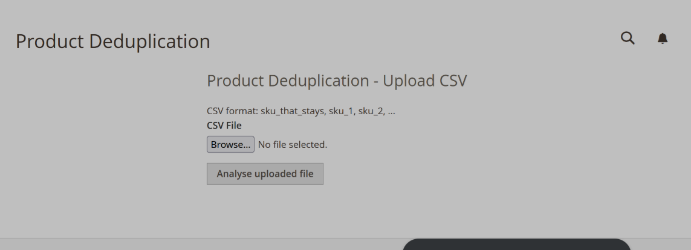
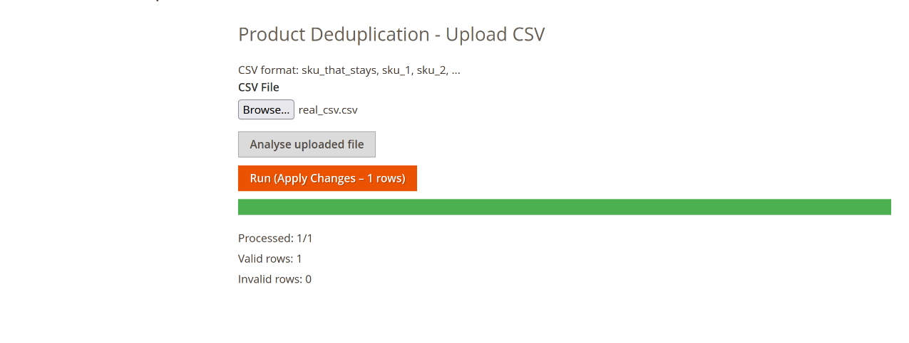
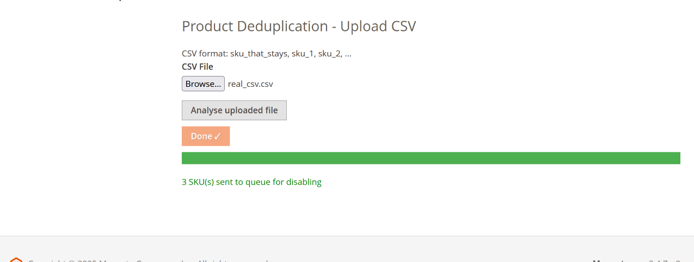
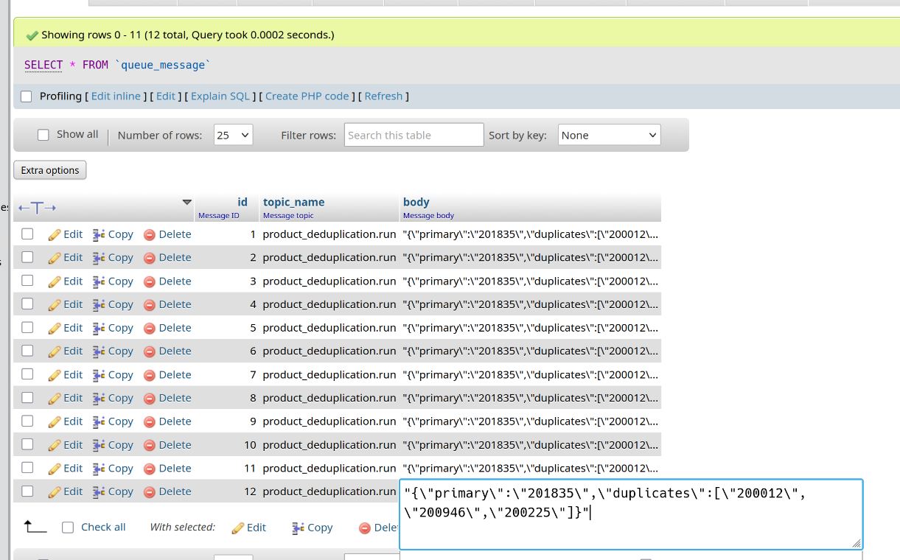
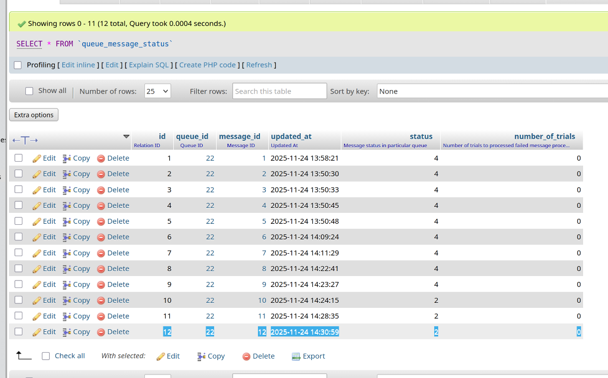
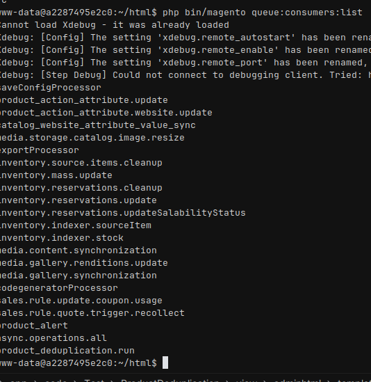
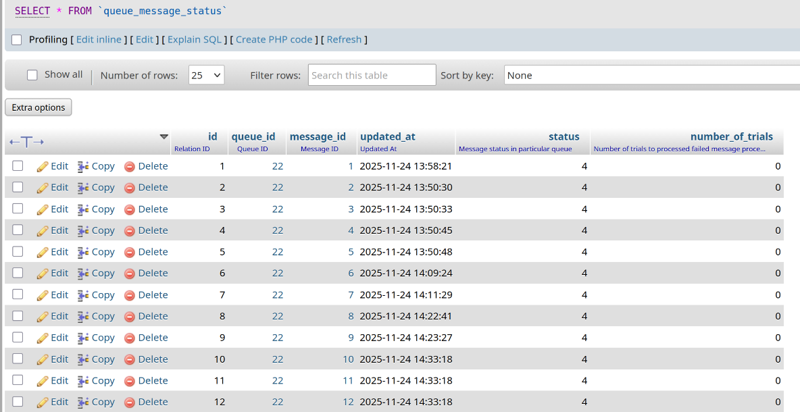
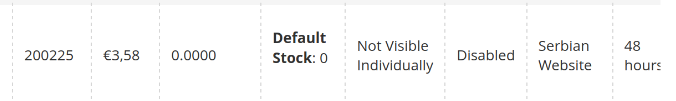
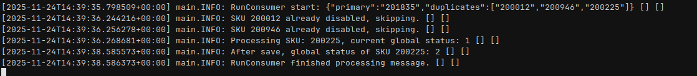

# Product deduplication
Admin dashboard -> Deduplication
From there, we can choose Product Deduplication or History.

## CSV Validation - What checks are essential and why?deduplication logic
Validation of CSV fields includes checks for:
- The row contains at least two columns
- None of the SKUs are empty
- Every SKU matches the allowed regex pattern
- At least one duplicate SKU is provided relative to the primary SKU
- No SKU is repeated within the same row

These validations ensure that the import process only processes complete and properly formatted data, preventing errors and maintaining data integrity.

## Deduplication logic
The preferred approach is to disable products that are duplicates. However, if there is an additional requirement, the admin can decide whether to disable or delete them.
Skip sku if it's already disabled

## Dry run
The Dry Run option analyzes which rows and columns are valid or invalid.

Valid and invalid rows are stored in the database as JSON.

The subsequent Run Process only executes valid SKUs; invalid rows are skipped automatically.

## Merging data, deletions, redirects, disabling
After disabling or deleting products, 301 redirects should be created programmatically for SEO purposes.

Additional data migration, such as transferring attributes, images, descriptions, reviews, etc., should be defined with the client or task owner to ensure important product data is preserved.

## Rollback Concept
Pre-run backup – Save the full state of the product (SKU, status, attributes, categories, stock, images, SEO URLs) before the product is disabled, deleted, or updated.

Data storage – Store backup data as JSON in a dedicated table; optionally keep key columns (status, stock, price) for faster rollback.

Backup timing – Create the backup before any destructive or update action during the import/deduplication process.

Rollback execution – Restore products from the backup: enable disabled products, recreate deleted products, revert updated attributes, and restore related entities (stock, URLs, images, reviews).

Full vs Partial – A full backup allows complete restoration; partial rollback restores only key fields for speed.

Best practices – Rollback should be a manual process triggered by the admin; backups must be stored reliably, and old backups should be cleaned up after a successful commit.

## Commands
After you clicked Analyse and then Run, if it is sent successfully run command below for execution message in the queue:

php bin/magento queue:consumers:start product_deduplication.run

List queue consumers:
php bin/magento queue:consumers:list

This can be automated with Cron job.

## Module Screenshots

1. 
2. 
3. 
4. 
5. 
6. 
7. 
8. 
9. 
10. 
